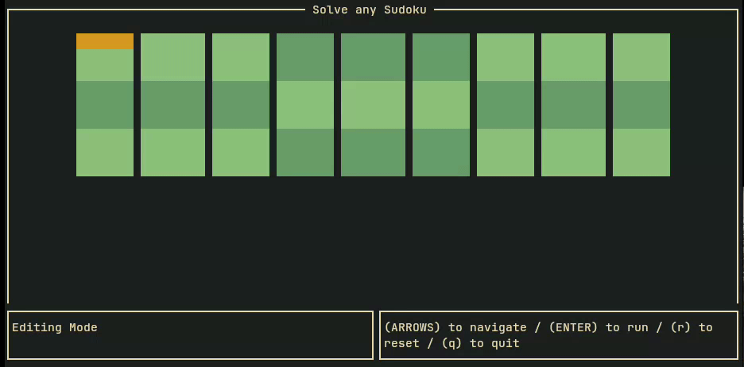

# Kaidoku

Kaidoku is a terminal-based Sudoku solver written in Rust, utilizing the [ratatui](https://github.com/tui-rs-revival/ratatui) library for a rich Text User Interface (TUI) experience.

## Preview



## Features

- Solve Sudoku puzzles of varying difficulty levels.
- Intuitive and interactive TUI.
- WFC solving algorithm.

## Installation

Make sure you have Rust and Cargo installed on your system.

1. **Clone the Repository**

```bash
git clone https://github.com/v1nc33n7/kaidoku.git
```

2. Navigate to the folder

```bash
cd kaidoku
```

3. Install on your system

```bash
sudo make install
```

4. Or run the application

```bash
cargo run --release
```
